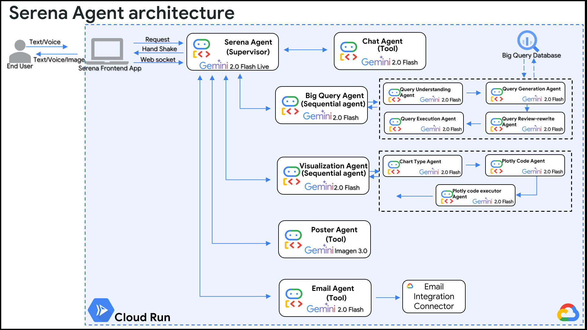

# Serena: The AI-Powered Marketing Co-Pilot 🚀

[](https://www.youtube.com/watch?v=lBWKiWUYHLM)
[](https://medium.com/@novoforce/building-serena-a-multi-agent-ai-for-proactive-marketing-powered-by-googles-agent-development-ec53a3657fa6)

**Serena is an advanced, multi-agent AI assistant that transforms natural language business questions into fully executed, hyper-personalized marketing campaigns in seconds.**

> **Note:** This project was created for the purpose of entering the **Agent Development Kit Hackathon with Google Cloud**.

---

### The Problem: The Gap Between Data and Action
E-commerce businesses are sitting on a goldmine of data: customer profiles, order histories, and browsing behavior. However, the path from this data to a timely, effective marketing campaign is fraught with friction. A marketing manager needs to:
1.  Request a report from a data analyst.
2.  Wait for the results.
3.  Manually interpret the data to find a segment.
4.  Brief a creative team to produce assets.
5.  Finally, set up and launch the campaign.

This slow, multi-step process means opportunities are missed and personalization is often generic.

### Our Solution: A Conversational Action Engine
Serena eliminates this friction entirely. We created a unique solution where a non-technical user can have a single conversation to achieve an end-to-end outcome. By integrating a sophisticated multi-agent system, Serena doesn't just answer questions; it **understands intent, reasons through complex tasks, and takes direct action**.

The innovation lies in creating a **closed-loop system**:
**Question → Insight → Visualization → Action → Campaign Launch**

This transforms the user's role from a manual operator into a strategic director, guiding the AI to execute complex workflows instantly.

---

## 🎬 Demo and Documentation (20%)

A clear problem definition requires an effective presentation. Watch our 3-minute video demo to see the full power of Serena in action.

### Live Demo
[](https://www.youtube.com/watch?v=lBWKiWUYHLM)
*(Click the badge to watch the demo on YouTube)*

### Core Architecture
Our system's design is central to its success. The following diagram illustrates how our 13 agents, hosted on Google Cloud Run, collaborate to fulfill a user's request.



---

## 🛠️ Technical Implementation

Serena is built on a foundation of modern, scalable technologies, with a core focus on a robust multi-agent architecture.

### How We Used the Agent Development Kit (ADK)
The core of our technical execution is the effective use of **Google's Agent Development Kit (ADK)**. We didn't just use one agent; we architected a symphony of 13 agents working in concert, showcasing advanced ADK concepts.

1.  **The Supervisor Agent (`Serena Agent`)**:
    *   This is the central orchestrator, powered by `Gemini 2.0 Flash Live`.
    *   It uses the ADK's **tool-use/function-calling** capabilities to parse user intent and delegate tasks to the appropriate sub-agent. It's the "brain" that knows which specialized tool to use for a given job.

2.  **Sequential Agents**:
    *   To handle complex tasks, we implemented sequential agents that break down problems into a logical chain of steps. This is a powerful ADK pattern for increasing accuracy and reliability.
    *   **`Big Query Agent`**: Instead of a simple NL-to-SQL call, this agent executes a 4-step sequence: `Understand → Generate → Review/Rewrite → Execute`. This self-correction loop is critical for generating reliable SQL.
    *   **`Visualization Agent`**: This agent also follows a sequence (`Choose Chart Type → Generate Plotly Code → Execute Code`), allowing it to create bespoke, context-aware visualizations rather than canned charts.

3.  **Tool-Based Agents**:
    *   For direct actions, the Supervisor calls specific tool-based agents like the **`Poster Agent`** (using `Imagen 3.0`) and the **`Email Agent`**, demonstrating how the ADK can integrate with both generative models and external APIs.

This multi-agent, hierarchical structure is a direct and effective implementation of the principles provided by the Agent Development Kit (ADK).

### Tech Stack

| Category      | Technology / Service                                       |
| ------------- | ---------------------------------------------------------- |
| **AI/ML**     | Google Agent Development Kit (ADK), Gemini 2.0 Flash & Live, Imagen 3.0 |
| **Backend**   | Python 3.10, FastAPI, WebSockets                           |
| **Database**  | Google BigQuery                                            |
| **Cloud**     | Google Cloud Run (Dockerized)   |
| **Frontend**  | Plain HTML, CSS, Javascript                                         |
| **Connectors**  | GCP Integration connector                                     |

### Code Quality and Efficiency
*   **Clean Code:** The repository is structured logically with a clear separation of concerns. Each agent and its functions are encapsulated in its own module. We have used docstrings and comments to ensure the code is readable and maintainable.
*   **Efficiency:** We chose **Google Cloud Run** for its serverless nature, allowing the application to scale to zero to save costs while being able to handle bursts of traffic. The use of **`Gemini 2.0 Flash`** for most sub-agents was a deliberate choice for its optimal balance of speed, capability, and cost-effectiveness. The real-time, low-latency connection is handled efficiently by **WebSockets**.

### Setup and How to Run Locally

1.  **Clone the repository:**
    ```bash
    https://github.com/novoforce/cautious-palm-tree.git
    cd cautious-palm-tree
    ```

2.  **Set up a virtual environment:**
    ```bash
    python3 -m venv venv
    source venv/bin/activate
    ```

3.  **Install dependencies:**
    ```bash
    pip install -r requirements.txt
    ```

4.  **Configure environment variables:**
    *   Create a `.env` file in the root directory.
    *   Add your Google Cloud credentials and other necessary API keys:
      ```
      # .env
      GOOGLE_CLOUD_PROJECT_ID=""
      BIGQUERY_SERVICE_ACCOUNT_KEY_PATH=./YOUR_SERVICE_ACCOUNT.json
      INTEGRATION_CONNECTOR_SERVICE_ACCOUNT_KEY_PATH=./YOUR_SERVICE_ACCOUNT.json
      INTEGRATION_CONNECTOR_LOCATION=""
      BQ_LOCATION=""
      BQ_DATASET=""
      GOOGLE_API_KEY= "YOUR_API_KEY"
      METADATA_JSON_PATH= ./dataset_info.json
      
      MODEL_GEMINI_2_0_FLASH_LIVE="gemini-2.0-flash-live-001"
      GREETING_AGENT_GEMINI_MODEL="gemini-2.0-flash-001"
      BQ_AGENT_GEMINI_MODEL="gemini-2.0-flash-001"
      VISUALIZATION_AGENT_GEMINI_MODEL="gemini-2.0-flash-001"
      EMAIL_AGENT_GEMINI_MODEL="gemini-2.0-flash-001"
      POSTER_AGENT_GEMINI_MODEL="gemini-2.0-flash-001"
      IMAGE_GEN_GEMINI_MODEL="imagen-3.0-generate-002"

      ```

5.  **Run the application:**
    ```bash
    uvicorn app.main:app --reload
    ```

---

### The Full Story
For a deeper narrative on our journey building Serena, the challenges we faced, and our vision for the future, please read our detailed article on Medium.

➡️ **[Read "Building Serena: A Multi-Agent AI for Proactive Marketing" on Medium](https://medium.com/@novoforce/building-serena-a-multi-agent-ai-for-proactive-marketing-powered-by-googles-agent-development-ec53a3657fa6)**
